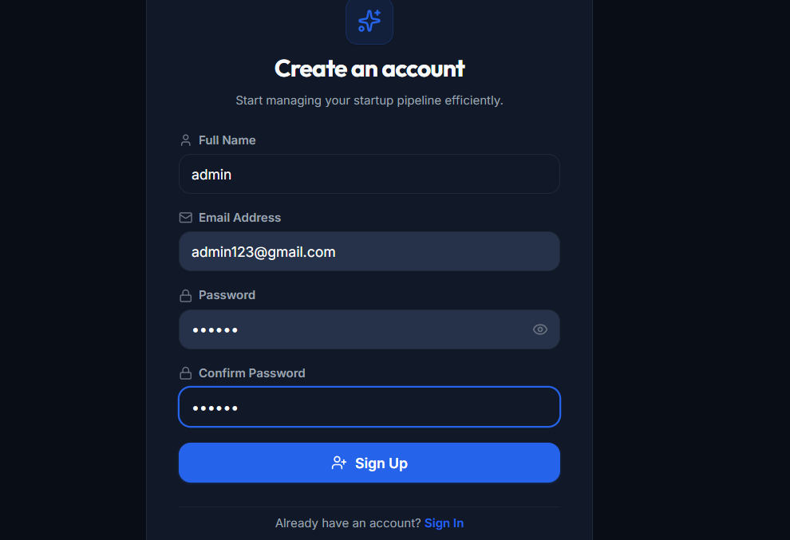
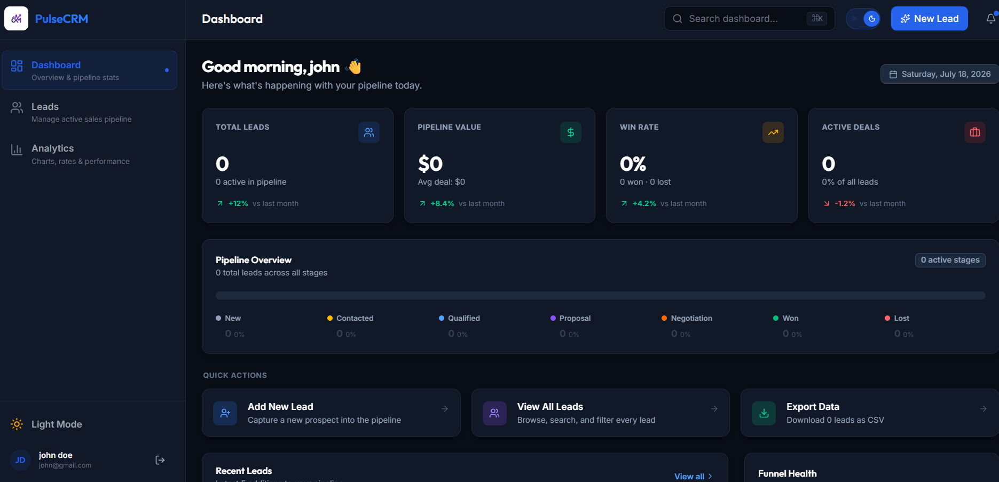
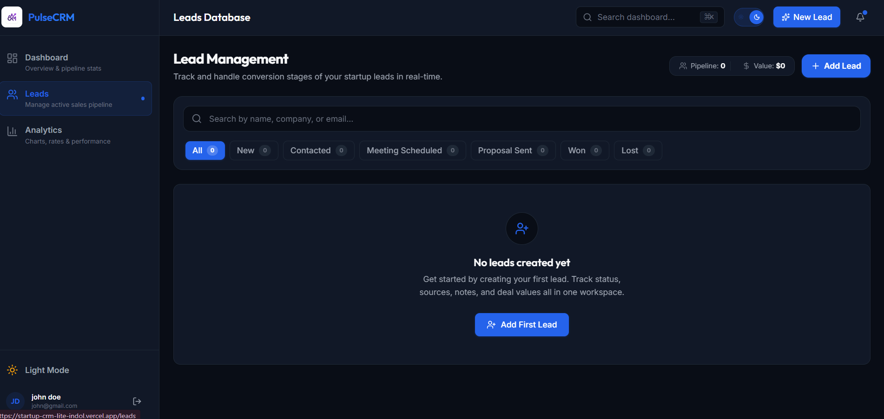
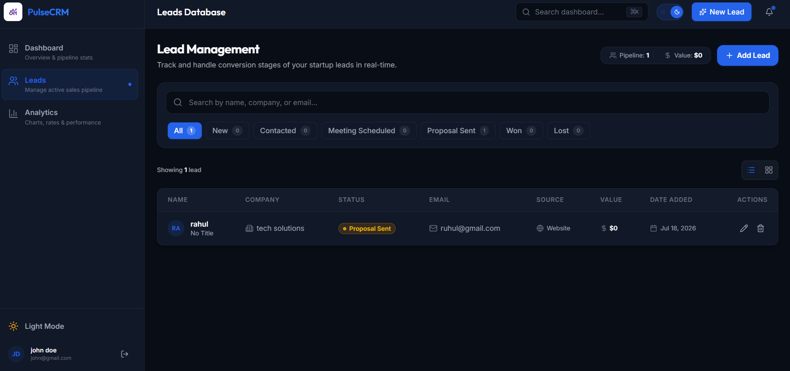
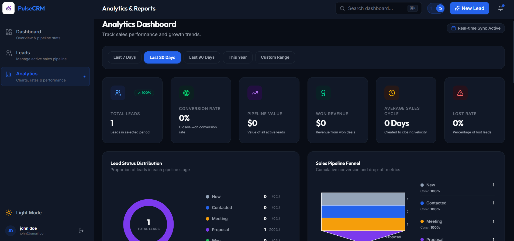
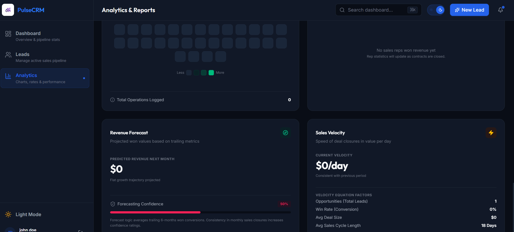

# 🚀 PulseCRM Lite

<div align="center">

### A Modern Customer Relationship Management (CRM) Dashboard built with the MERN Stack

Manage leads, visualize sales analytics, track customer interactions, and streamline your workflow through a responsive, secure, and intuitive CRM application.

<p align="center">
  <a href="https://startup-crm-lite-indol.vercel.app">
    
  </a>
  <a href="https://github.com/Harshini9245/startup-crm-lite">
    
  </a>
</p>

<p align="center">


</p>

</div>

---

# 📖 About the Project

**PulseCRM Lite** is a full-stack Customer Relationship Management (CRM) web application designed to simplify lead management and provide meaningful business insights through interactive analytics.

The application enables users to register securely, manage customer leads, track sales pipelines, monitor revenue trends, and visualize performance using dynamic dashboards.

Built using the **MERN Stack**, PulseCRM Lite combines a modern React frontend with a secure Express and MongoDB backend to deliver a responsive, scalable, and user-friendly experience.

---

# ✨ Key Features

### 🔐 Authentication
- Secure user registration and login
- JWT-based authentication
- Protected routes
- User profile management

### 📊 Dashboard
- Business overview
- KPI cards
- Revenue insights
- Pipeline overview
- Quick actions
- Recent lead activity

### 👥 Lead Management
- Add new leads
- Edit lead details
- Delete leads
- Search functionality
- Status filtering
- Lead pipeline tracking

### 📈 Analytics
- Revenue trends
- Monthly sales reports
- Funnel visualization
- Activity heatmap
- Forecast analysis
- Sales velocity metrics

### 🌙 User Experience
- Responsive layout
- Dark mode support
- Toast notifications
- Beautiful UI
- Fast navigation

---

# 🛠️ Tech Stack

| Category | Technologies |
|-----------|--------------|
| Frontend | React 19, Vite, React Router |
| Styling | Tailwind CSS v4 |
| Backend | Node.js, Express.js |
| Database | MongoDB |
| Authentication | JWT |
| Charts | Recharts |
| Icons | Lucide React |
| HTTP Client | Axios |
| Notifications | React Hot Toast |
| Security | Helmet, CORS, Mongo Sanitize, Rate Limiter |

---

# 🏗️ Project Architecture

```text
                    User
                      │
                      ▼
              React + Vite Frontend
                      │
        React Router │ Axios │ Context API
                      │
                      ▼
               Express REST API
                      │
      JWT Authentication Middleware
                      │
                      ▼
              MongoDB Database
```

---

# 📸 Project Screenshots

## 🔐 User Authentication

<p align="center">
  
</p>

---

## 📊 Dashboard

<p align="center">
  
</p>

---

## 👥 Lead Management (Empty State)

<p align="center">
  
</p>

---

## 👥 Lead Management (With Data)

<p align="center">
  
</p>

---

## 📈 Analytics Dashboard

<p align="center">
  
</p>

---

## 📉 Forecast & Sales Velocity

<p align="center">
  
</p>
---

# 📂 Project Structure

```text
startup-crm-lite
│
├── backend
│   ├── controllers
│   ├── middleware
│   ├── models
│   ├── routes
│   ├── config
│   ├── utils
│   ├── server.js
│   └── package.json
│
├── frontend
│   ├── public
│   ├── src
│   │   ├── components
│   │   ├── contexts
│   │   ├── hooks
│   │   ├── pages
│   │   ├── routes
│   │   ├── services
│   │   ├── utils
│   │   └── assets
│   └── package.json
│
└── README.md
```

---

# ⚙️ Installation & Setup

## 1️⃣ Clone the Repository

```bash
git clone https://github.com/Harshini9245/startup-crm-lite.git

cd startup-crm-lite
```

---

## 2️⃣ Install Frontend Dependencies

```bash
cd frontend
npm install
```

---

## 3️⃣ Install Backend Dependencies

```bash
cd ../backend
npm install
```

---

## 4️⃣ Configure Environment Variables

Create a `.env` file inside the **backend** folder.

Example:

```env
PORT=5000

MONGODB_URI=your_mongodb_connection_string

JWT_SECRET=your_secret_key
```

---

## 5️⃣ Start Backend

```bash
npm run dev
```

---

## 6️⃣ Start Frontend

```bash
cd ../frontend

npm run dev
```

---

Open your browser and visit:

```
http://localhost:5173
```

---

# 📌 Highlights

- ✅ Secure JWT Authentication
- ✅ RESTful API Architecture
- ✅ Interactive Dashboard
- ✅ Sales Analytics
- ✅ Revenue Visualization
- ✅ Responsive Design
- ✅ Dark Theme Support
- ✅ Modular Code Structure
- ✅ MongoDB Integration
- ✅ Production Ready UI

---
---

# 📡 API Endpoints

## 🔐 Authentication

| Method | Endpoint | Description |
|--------|----------|-------------|
| POST | `/api/auth/register` | Register a new user |
| POST | `/api/auth/login` | Login user |
| GET | `/api/auth/profile` | Get logged-in user profile |
| PUT | `/api/auth/profile` | Update profile |
| POST | `/api/auth/logout` | Logout user |

---

## 👥 Lead Management

| Method | Endpoint | Description |
|--------|----------|-------------|
| GET | `/api/leads` | Get all leads |
| POST | `/api/leads` | Create a new lead |
| GET | `/api/leads/:id` | Get lead by ID |
| PUT | `/api/leads/:id` | Update lead |
| PATCH | `/api/leads/:id/status` | Update lead status |
| DELETE | `/api/leads/:id` | Delete lead |

---

## 📊 Analytics

| Method | Endpoint | Description |
|--------|----------|-------------|
| GET | `/api/leads/stats` | Dashboard statistics |
| GET | `/api/leads/stats/summary` | Overall summary |
| GET | `/api/leads/monthly-stats` | Monthly analytics |
| GET | `/api/leads/stats/monthly` | Revenue trends |
| GET | `/api/leads/search` | Search leads |

---

# 🔒 Security Features

- ✅ JWT Authentication
- ✅ Password Hashing
- ✅ Protected Routes
- ✅ Helmet Security Middleware
- ✅ MongoDB Sanitization
- ✅ CORS Configuration
- ✅ Rate Limiting
- ✅ Input Validation
- ✅ Error Handling Middleware

---

# 🚀 Deployment

The application is deployed on **Vercel**.

### 🌐 Live Demo

👉 **https://startup-crm-lite-indol.vercel.app**

---

# 💻 Local Development

### Backend

```bash
cd backend
npm install
npm run dev
```

### Frontend

```bash
cd frontend
npm install
npm run dev
```

Visit:

```
http://localhost:5173
```

---

# 📈 Future Enhancements

Some features planned for future releases include:

- Email notifications
- Calendar integration
- Customer notes and activity timeline
- File and document uploads
- Advanced reporting
- Team collaboration
- Role-Based Access Control (RBAC)
- AI-powered sales insights
- Mobile application
- Multi-language support
- Cloud file storage
- Real-time notifications using WebSockets

---

# 🎯 Learning Outcomes

This project strengthened my understanding of:

- Full Stack Web Development
- React Component Architecture
- Context API State Management
- REST API Development
- MongoDB CRUD Operations
- Authentication with JWT
- Express Middleware
- Data Visualization using Recharts
- Responsive UI Design
- API Integration using Axios
- Secure Backend Development
- Deployment Workflow

---

# 📂 Folder Overview

```
backend/
│
├── controllers/
├── middleware/
├── models/
├── routes/
├── config/
├── utils/

frontend/
│
├── assets/
├── components/
├── contexts/
├── hooks/
├── pages/
├── routes/
├── services/
├── utils/
```

---

# 🤝 Contributing

Contributions are welcome!

If you'd like to improve this project:

1. Fork the repository
2. Create a feature branch
3. Commit your changes
4. Push the branch
5. Open a Pull Request

---

# 🐞 Reporting Issues

Found a bug?

Please open an issue describing:

- The problem
- Steps to reproduce
- Expected behavior
- Screenshots (if applicable)

---

# 📄 License

This project is licensed under the **MIT License**.

Feel free to use, modify, and learn from this project.

---

# 👩‍💻 Author

## Harshini Putta

**Computer Science Engineering Student**

📍 India

### Connect with me

- 🐙 GitHub: https://github.com/Harshini9245
- 💼 LinkedIn: https://www.linkedin.com/in/harshini-putta-ba304932b

---

# 🌟 Support

If you found this project helpful:

⭐ Star this repository

🍴 Fork the project

📢 Share it with others

Your support motivates me to build more useful open-source projects.

---

<div align="center">

## 🚀 Thank You for Visiting!

**PulseCRM Lite**

*A Modern CRM Dashboard built using the MERN Stack.*

Made with ❤️ by **Harshini Putta**

</div>